# Water Quality Prediction

# Summary
1. Problem Description
2. Dependency and environment management
3. EDA
4. Data preparation
5. Model training and tuning
6. Comparing models' performance and training the best
7. Creating python scripts from notebook
8. Local model deployment with Flask
9. Local model deployment with Docker
10. Cloud model deployment with AWS Elastic Beanstalk


## 1. Problem Description
Drinking water or potable water is water that is safe for ingestion, either when drunk directly in liquid form or consumed indirectly through food preparation. It is often (but not always) supplied through taps, in which case it is also called tap water. Since water is so important for human health, the development of a service that predicts its potability is valuable.

For the ML Zoomcamp mid-term project, several machine learning models were evaluated, and the best-performing one was deployed as a public web service on AWS using Elastic Beanstalk.

The dataset used is the one found on Kaggle: https://www.kaggle.com/datasets/adityakadiwal/water-potability


## 2. Dependency and environment management
Pipenv was used to create the virtual environment and install the dependencies. In order to follow the development of the project you must clone the [repository](https://github.com/jdanussi/ml-zoomcamp-2024-midterm-project.git), create the virtual environment installing the required dependencies and activate it as demonstrated below.


```bash

# Clone the project repository
> git clone https://github.com/jdanussi/ml-zoomcamp-2024-midterm-project.git

# Change dir to the project folder
> cd ml-zoomcamp-2024-midterm-project

# Create a new virtual environment and install the project dependencies
> pipenv install

# Activate the new environment
> pipenv shell

# Check the python path in the new environment
> which python

```


## 3. EDA
In statistics, exploratory data analysis (EDA) is an approach of analyzing data sets to summarize their main characteristics, often using statistical graphics and other data visualization methods.

In the [Exploratory Data Analysis (EDA)](notebook.ipynb#exploratory-data-analysis-eda) section of the notebook, summary statistics of the dataset were examined, missing values were imputed using mean values, and the correlations between variables were analyzed. Most variables were found to be largely independent, except for a notable correlation between **solids** and **sulfate**, and a weaker correlation between **solids** and **ph**.


## 4. Data preparation
In the [Data Preparation](notebook.ipynb#data-preparation) section of the notebook, the column names in the dataset were converted to lowercase for consistency. The data was then split into three subsets: training (60%), validation (20%), and testing (20%).
Since all features in the dataset are numeric, no encoding was required.


## 5. Model training and tuning
In this project, three machine learning models were trained and tuned: **Decision Tree**, **Random Forest**, and **XGBoost** (eXtreme Gradient Boosting).

- The Decision Tree model was optimized by evaluating different values for the *max_depth* and *min_samples_leaf* hyperparameters.
- The Random Forest model was fine-tuned by testing various values for *max_depth*, *min_samples_leaf*, and *n_estimators*.
- Finally, the XGBoost model was tuned by exploring different values for *max_depth*, *eta*, and *min_child_weight*.


## 6. Comparing models' performance and training the best
The models were trained using the optimal hyperparameters identified earlier and compared based on their AUC scores. Random Forest emerged as the best-performing model, achieving a 0.96% improvement over XGBoost and a 6.58% improvement over Decision Tree.


## 7. Creating python scripts from notebook
The notebook was used to develop the Python scripts `train.py` and `predict.py`. The `train.py` script trains the Random Forest model, which demonstrated the best performance, and saves the trained model as a pickle file. This file is then utilized in the predict.py script for making predictions.

To train the Random Forest model and save it as a pickle file, run the following command:

```bash

> python train.py 

training the final model

the model is saved to model_rf_230_10_1.bin

```

## 8. Local model deployment with Flask
To evaluate the water potability prediction service through the Flask web application, follow these steps:

```bash

# Deploy a local service for water potability prediction using Flash
> python predict.py 
 * Serving Flask app 'potability'
 * Debug mode: on
WARNING: This is a development server. Do not use it in a production deployment. Use a production WSGI server instead.
 * Running on all addresses (0.0.0.0)
 * Running on http://127.0.0.1:9696
 * Running on http://192.168.0.19:9696
Press CTRL+C to quit
 * Restarting with stat
 * Debugger is active!
 * Debugger PIN: 308-512-644
127.0.0.1 - - [25/Nov/2024 07:55:48] "POST /predict HTTP/1.1" 200 -


# Test the flask web service from other terminal of the same instance
> python predict-test.py 
{'potability': False, 'potability_probability': 0.20214878729185673}
Water sample id water-230 is Non-potable water
>

```


## 9. Local model deployment with Docker

```bash
# Build the docker image
> docker build -t potability-predict .

# Deploy a local service for water potability prediction using a docke container
> docker run -it --rm -p 9696:9696 potability-predict:latest
[2024-11-25 11:01:13 +0000] [1] [INFO] Starting gunicorn 23.0.0
[2024-11-25 11:01:13 +0000] [1] [INFO] Listening at: http://0.0.0.0:9696 (1)
[2024-11-25 11:01:13 +0000] [1] [INFO] Using worker: sync
[2024-11-25 11:01:13 +0000] [7] [INFO] Booting worker with pid: 7


# Test the containerized service from other terminal of the same instance
> python predict-test.py
{'potability': False, 'potability_probability': 0.20214878729185673}
Water sample id water-230 is Non-potable water
>

```


## 10. Cloud model deployment with AWS Elastic Beanstalk
The drinking water prediction service was deployed on AWS using Elastic Beanstalk. It is accessible at the public URL: http://water-potability-prediction-env.eba-3deujbm3.us-east-1.elasticbeanstalk.com/predict. 

Before creating the application in Beanstalk, you need to generate a PEM key pair for SSH access to the EC2 instance and set up a security group to allow traffic on the SSH (TCP 22) and HTTP (TCP 80) ports for the prediction service.

Below are screenshots showing the details of the PEM key and the security group that were created.

Pem key *ml-zoomcamp*
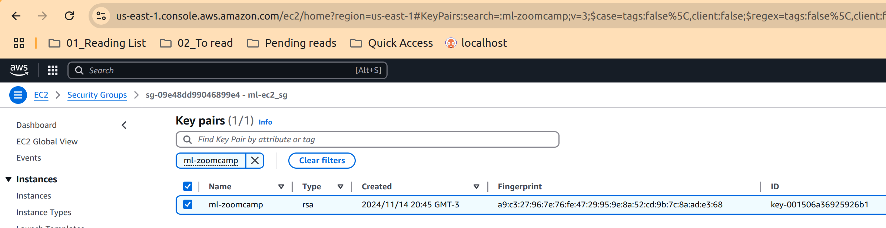

Security Group *ml-ec2_sg*
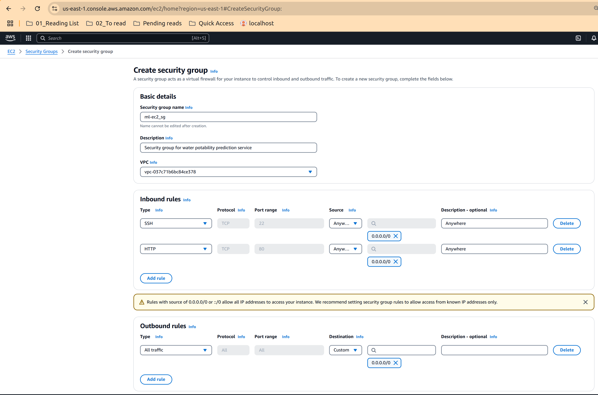

It is also necessary to package the application in order to upload it to Elastic Beanstalk:

```bash

zip ../app.zip -r * .[^.]*

```

Below are screenshots with the steps taken to create the service from the AWS console.

Create a new application:
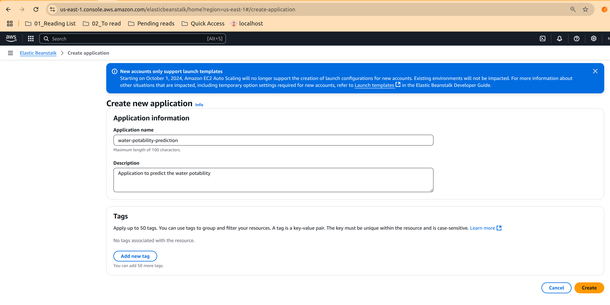

Image2:
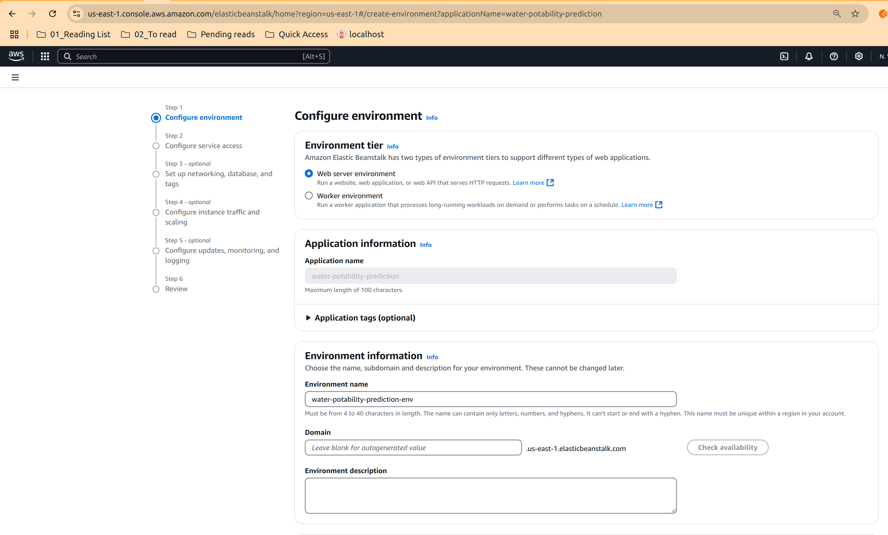

Image3:
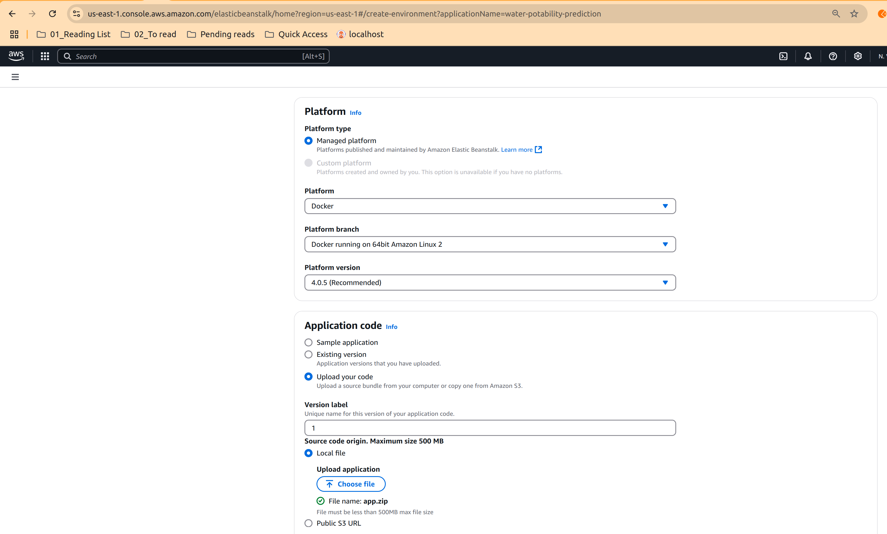

Image4:


Image5:
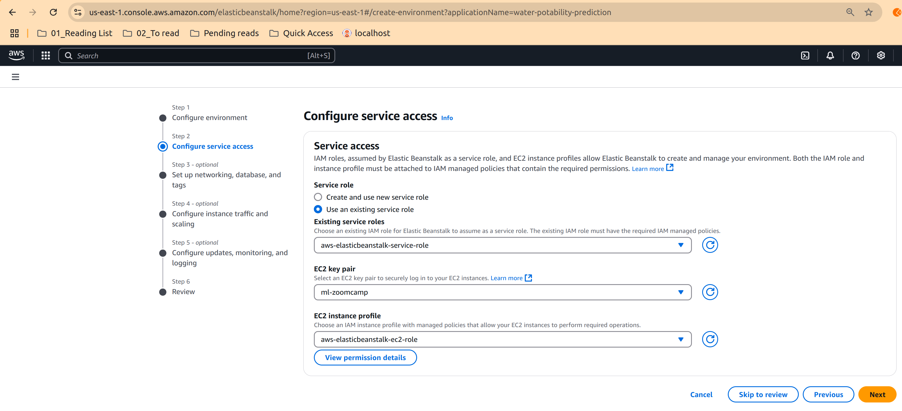

Image6:
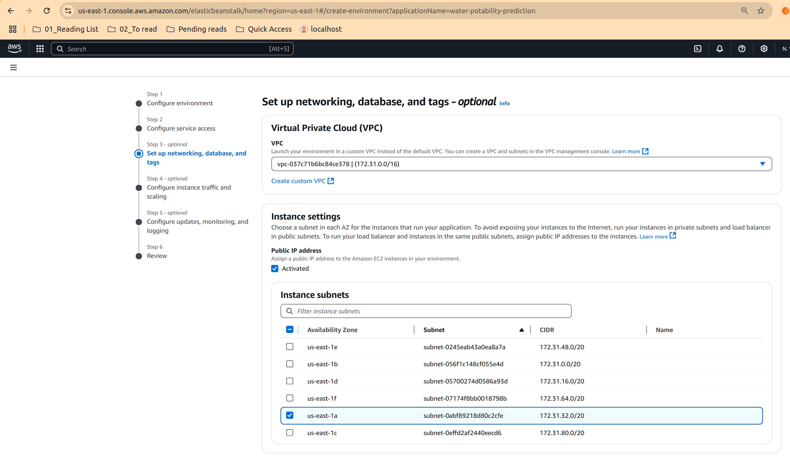

Image7:
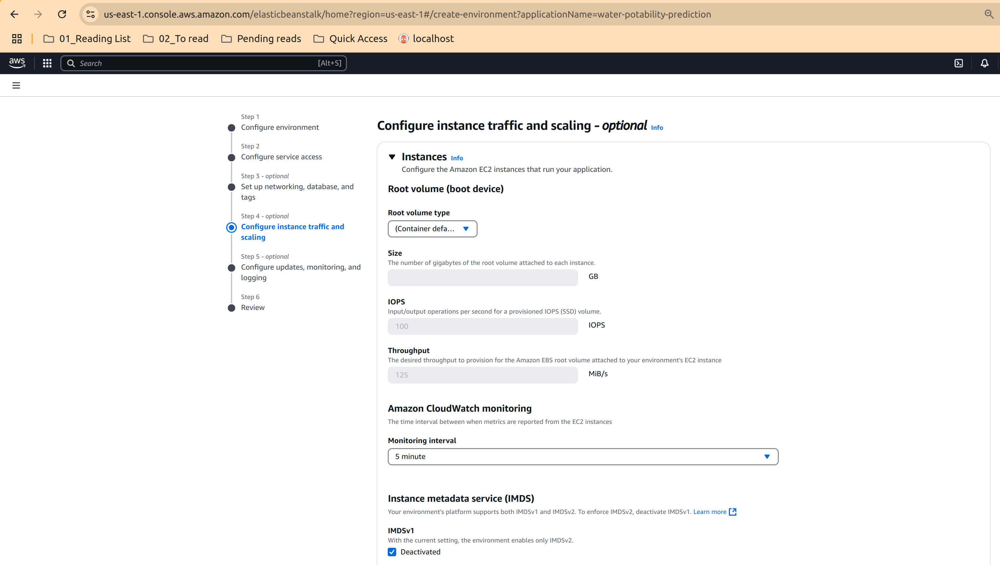

Image8:
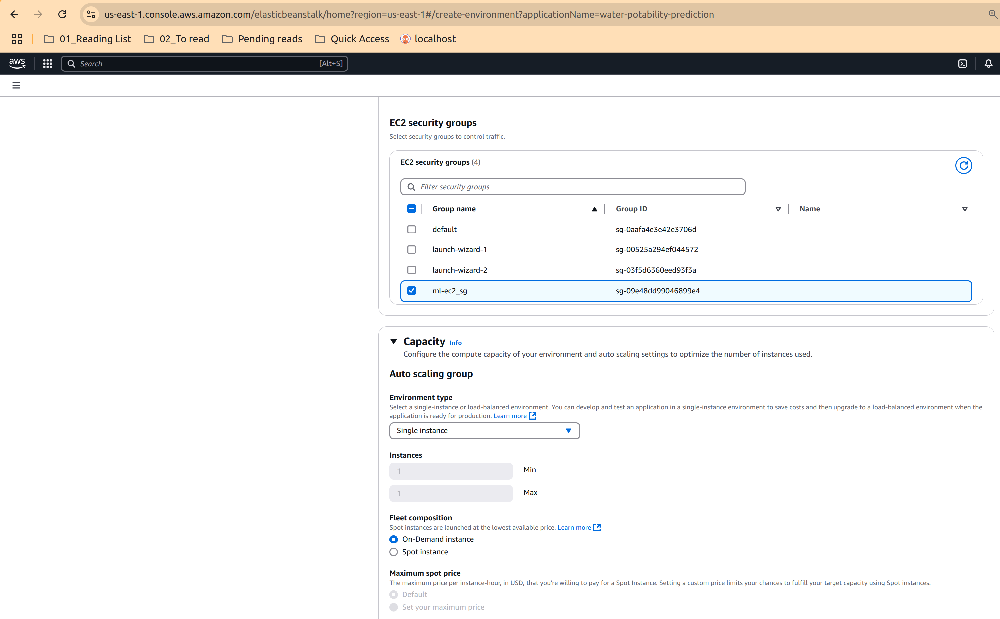

Image9:
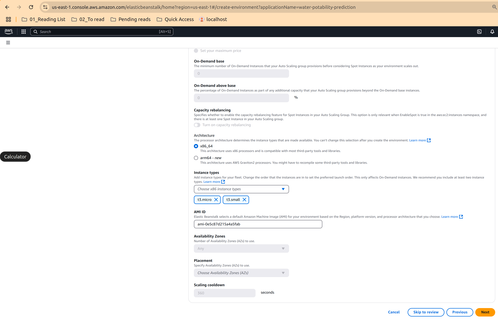

Image10:
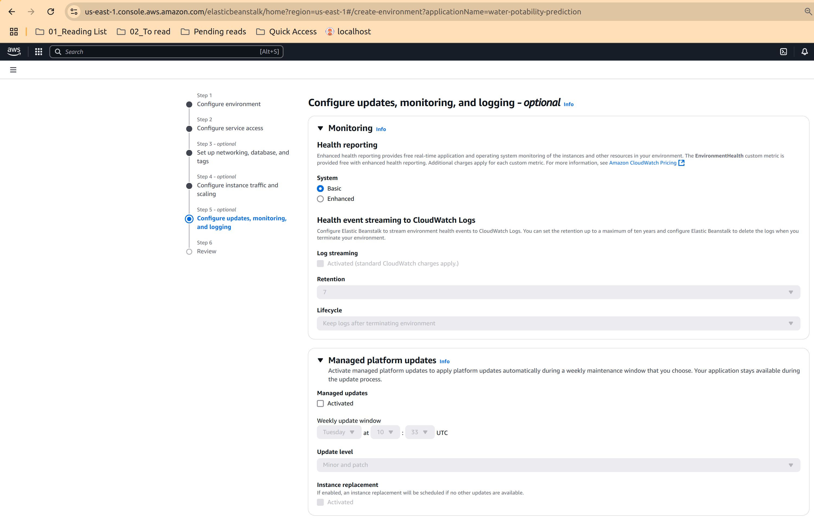

Image11:
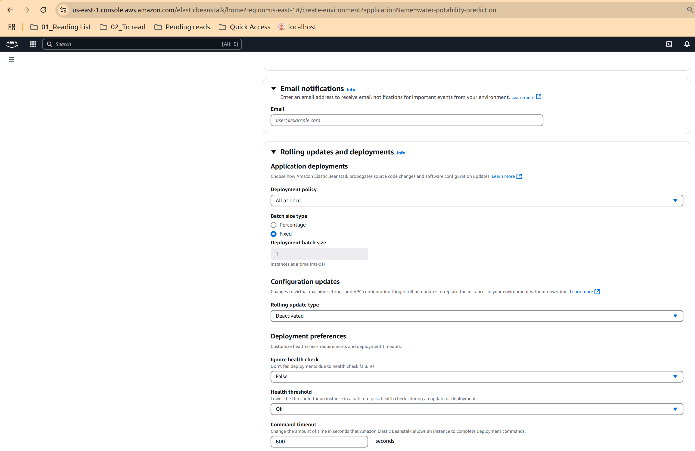

Image12:
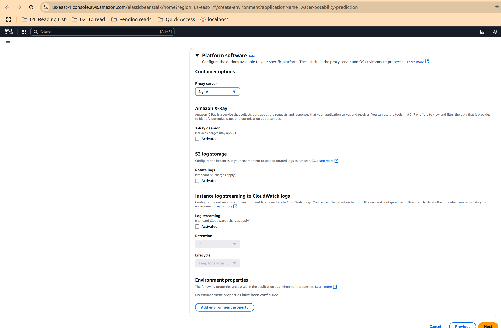

Image13:
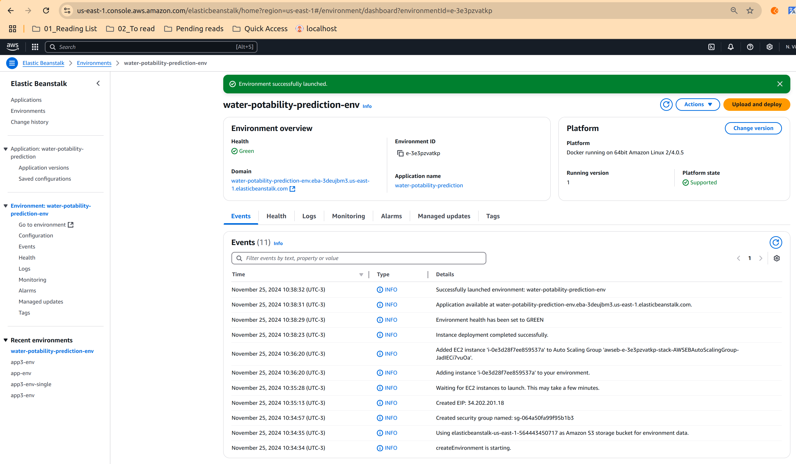

```bash

# Test the same service deployed in AWS Elasticbealstalk

After the application is successfully deployed to Elastic Beanstalk, update the *url* parameter in the `predict-test-eb.py` script with the URL of the created environment. For example:

```python

url = 'http://water-potability-prediction-env.eba-3deujbm3.us-east-1.elasticbeanstalk.com/predict'

```

You can then test the public prediction service as follows:
> python predict-test-eb.py
{'potability': False, 'potability_probability': 0.20214878729185673}
Water sample id water-230 is Non-potable water
> 

```
